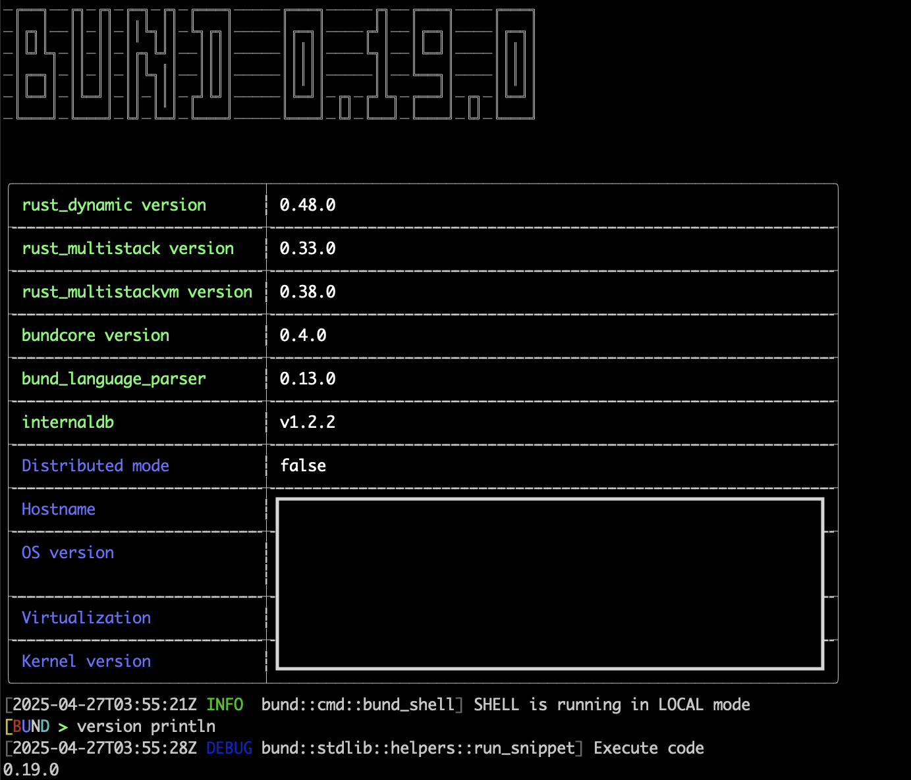

# BUND concatenative language interpreter and shell.

I am pleased to introduce a new concatenative multiparadigm programming language known as BUND. Prior to delving into the features of BUND, it is imperative to comprehend the nature of concatenative or "stack-based" languages, distinguishing them from other programming languages with which one may be acquainted. We will now discuss several commonly used programming paradigms.
Imperative programming languages are characterized by the explicit definition of sequences of operations that a computer must execute to achieve specific objectives. This paradigm employs statements that alter the program's state. Prominent examples of imperative languages include C, Python, and Bash, along with several contemporary languages that, despite being multiparadigm, are predominantly grounded in imperative architecture, such as Typescript and Nim. Within these languages, the emphasis lies on outlining the operational procedures of a program through control structures like loops, conditionals, and assignments, which prescribe the precise steps for task execution.
Object-oriented languages, represented by C++, Smalltalk, and Python, characterize a paradigm focused on the concept of "objects," instances of classes that encapsulate attributes and behaviors. These classes enclose data and functions operating on the said data within a unified entity. Object-oriented programming (OOP) languages facilitate a structured approach to software design, simplifying the management of complex systems by modeling real-world entities and their interactions. This paradigm is widespread as it supports scalable, reusable, and maintainable code development, thus garnering popularity across diverse applications.

Functional programming languages, such as Lisp, Haskell, and ML, embody a paradigm that conceptualizes computation as the evaluation of mathematical functions, eschewing state changes or mutable data. This paradigm accentuates function application, characterized by immutability and absence of side effects. In functional programming, functions are regarded as first-class citizens, capable of being assigned to variables, passed as arguments, and returned as values from other functions. This fosters high abstraction and modularity in code. Core principles encompass functions as primary constructs, pure functions yielding consistent output for identical input, and higher-order functions accepting other functions as arguments or returning them.

Conversely, concatenative programming languages constitute a distinct category wherein functions are composed by concatenating smaller functions. Unlike conventional programming paradigms, which typically depend on explicit parameters and variable names for inter-function data transmission, concatenative languages adopt a more implicit approach. The output of one function serves as the input for the subsequent function, facilitating a fluid data flow. This model is commonly executed using a stack, where data is pushed onto the stack by one function and subsequently popped off by the next, enabling significant composability and modularity as functions can be effortlessly combined and reused without intricate parameter passing or variable management. While the stack remains the prevalent method for this transfer, certain concatenative languages do not utilize a stack. This context transfer of data produces the concatenation of data processing, rendering concatenative languages beneficial for specific applications. Although less widespread within software development communities, languages such as Forth, PostScript, and Factor might be recognized by many IT enthusiasts.


## Why shall I learn a new language ?

Learning new programming languages enhances your skills, offering fresh perspectives and problem-solving methods. Each language has unique features for specific tasks, improving your understanding of computational concepts and adaptability. This knowledge makes you a more versatile programmer, enabling better tool selection and informed system design decisions. Understanding multiple languages highlights their strengths and limitations, aiding in framework selection. But why should you invest time in concatenative languages and BUND?

## Why shall I invest in learning "Stack-based" languages ?

Concatenative languages are known for their simplicity and efficiency. They allow functions to be composed through concatenation, streamlining data flow and making code more readable and maintainable. These languages utilize a stack-based execution model where operations are performed using a last-in, first-out (LIFO) data structure. This model eliminates the need for complex variable scope management, reducing overhead and enhancing performance, which is especially beneficial in resource-constrained environments like embedded systems or low-power devices.
The minimalistic syntax of concatenative languages makes them easy to learn and use, focusing on program logic and functionality rather than elaborate syntax rules. In Forth, a concatenative language, commands and functions are defined with keywords and executed sequentially. This approach alone can help reduce the learning curve for new programmers. Additionally, this syntax allows for rapid prototyping and iterative development, as changes can be quickly tested and refined.
Furthermore, concatenative languages support high levels of code reusability and modularity. Functions can be easily combined and reused across different parts of a program without the risk of name collisions or unintended side effects. This modular approach promotes cleaner and more maintainable codebases.
These languages offer a powerful framework for creating efficient and maintainable software, making them ideal for applications that require high performance and reliability. Examples include real-time systems, data processing, telecommunications, and control systems, where the predictability and efficiency of concatenative languages can lead to more robust solutions.

## And what are the key benefits of the BUND ?

However, traditional concatenative languages exhibit certain shortcomings. They often lack robust data storage capabilities and effective execution context separation and isolation. BUND addresses these issues by implementing both named and anonymous data storage and execution contexts.

Metaprogramming is a programming technique that involves writing programs which can manipulate other programs or themselves as data. This paradigm facilitates the development of code that can dynamically generate, transform, analyze, and modify other code. By treating code as data, metaprogramming enhances flexibility and abstraction, allowing developers to create more generic, reusable, and adaptable software. In many concatenative languages, metaprogramming functionalities are either absent or planned for future implementation. BUND offers sophisticated, ready-to-use metaprogramming capabilities.

And there is more ...

### BUND still is conceptually "stack-based" language, but ...

```rust
//
// This is faimous HelloWorld program
//
"Hello world!" println
```

When discussing the nature of the BUND language, it is essential to note that BUND remains a fundamentally "stack-based" or "concatenative" language. However, it addresses certain significant shortcomings associated with traditional stack-based computations, particularly in data isolation. In classic stack-based languages such as Forth, all data are stored in an extensive stack without clear definitions and boundaries, making it difficult to distinguish where one computation ends and another begins. This approach, while simplifying some aspects of programming, introduces new challenges.
In these traditional systems, the responsibility of maintaining boundaries between computations falls on the developer, proving to be cumbersome. To alleviate this burden, BUND integrates the concept of a "stack-of-stacks," forming a ring structure wherein each element of the ring functions as a storage stack. This allows for logical separation of data chunks and distinct computations within separate stacks rather than a single stack containing all data for various operations. Additionally, BUND offers a stack named "Workbench," designed to store intermediate computational results in specific stacks and facilitate merging or exchanging these results. Thus, BUND is a concatenative language with unique enhancements that simplify the tasks of architects and programmers.

BUND incorporates certain elements of imperative programming, notably the support for variables. It allows you to extract an element from the stack and store it as a variable for future retrieval. As a language developer, I advise exercising caution when utilizing these features. However, a careful and measured approach to using these features can enhance code clarity and manageability. Consequently, rather than enforcing adherence to a single paradigm, I opted to provide developers with the flexibility to choose.

```rust
//
// This is a partial application demo
//
:greeting curry
  :data [
    "world "
    "!"
  ] set
  :lambda { + swap + println } set
!

"Hello " greeting
```
BUND incorporates certain features typically associated with the functional programming paradigm. Notably, BUND supports first-class functions, meaning that its "words" or functions can read and process references to other functions or return references to system or user-defined functions to the stack. Among the many implemented capabilities, BUND includes a functional, high-order mapping function. Although BUND functions are not pure due to the potential for side effects, developers must be aware of this aspect. Additionally, BUND supports partial application and currying, albeit indirectly; while these two features are related, they are distinct. Despite BUND not being originally designed as a functional language, I have incorporated some functional features when they offer benefits to users, enhancing code compactness, clarity, and efficiency.

Finally, BUND offers object-oriented features. As a stack-based language, BUND supports classes and objects as data types. From an object-oriented programming (OOP) perspective, BUND is an object-oriented language with multiple inheritance. It provides software developers with a library of classes that implement common data structures, thereby assisting in encapsulating data within objects. Methods associated with objects can be called to manipulate the encapsulated data. However, despite these functional features, I have never conceived of BUND primarily as an OOP tool. I simply incorporate some OOP features that I consider beneficial.

In summary, BUND could be described as a "stack-based concatenative multiparadigm" language.


## What you can do with the BUND ?

BUND offers a wide range of features that extend beyond simple file system commands such as cp (to copy files), cwd (to change the working directory), and rm (to remove files or directories), transforming it into a functional OS shell capable of handling a variety of tasks. Additionally, BUND provides an extensive library for telemetry and data analysis, which includes standard mathematical functions like trigonometric calculations, logarithms, and exponentials, as well as statistical functions such as mean, median, mode, standard deviation, and variance.

The tool also supports advanced data analysis capabilities including pattern detection using algorithms like k-means clustering, classification using decision trees or support vector machines, and forecasting using techniques like Markov chains and MSTL (Multiple Seasonal-Trend decomposition using Loess) forecasting. For data processing, BUND facilitates the import of input data in formats like CSV and JSON, allowing users to easily ingest and manipulate datasets. It includes an SQL-based internal database engine for efficient data transformation and analysis, offering the choice to store this data either in process memory for faster access or on disk for persistence. Data can be imported into this internal database using multiple formats such as CSV for tabular data, JSON for nested structures, and Parquet for columnar storage which is typically used in analytics workloads.

Furthermore, BUND advancing in graph theory applications by providing various graph algorithms capable of determining the shortest or alternative paths between nodes, which are highly useful in scenarios such as network optimization, route planning, and root cause analysis.

It also includes robust natural language processing (NLP) tools for text classification (e.g., categorizing emails as spam or not spam), splitting documents into sentences or phrases, parsing complex sentence structures, and detecting languages, making it suitable for many NLP tasks.

Staying current with AI advancements, BUND integrates machine learning capabilities through a single vector perceptron, a type of artificial neuron model used for binary classifiers. Although it does not currently support model storage and loading formats, training data can be saved externally.

BUND also includes data generators that create synthetic data samples based on various distributions such as normal (Gaussian), uniform (equal probability across ranges), log-normal (logarithmic scales), periodic (repeating patterns), sawtooth (linear rise/fall), sinusoidal (wave-like patterns), and square waves. These generated samples can be utilized for purposes such as training the perceptron or testing algorithms.
Moreover, BUND incorporates a Markdown formatter to assist users in preparing documents in Markdown format, facilitating tasks like documentation creation and report generation with rich text formatting.

In terms of programming language features, BUND provides access to standard constructs found in modern programming languages. These include various looping mechanisms (for, while, do-while), conditional statements (if, if-then-else), exception handling (try-except clauses), user-defined functions, pointers for system and user-defined functions, and function aliases for shorthand references. Code execution is managed within isolated contexts known as namespaces, which allow users to create temporary ad-hoc namespaces to encapsulate specific operations. As a dynamically-typed language, BUND supports numerous data types expected from contemporary languages, such as numerical values (integers, floats), lists (arrays), dictionaries (hash maps), and JSON objects for structured data representation.

## What kind of tools BUND offering for developers ?

The development features of BUND are continuously evolving. Users will have access to several advanced tools:

* A virtual-machine level debugger, which allows developers to closely inspect and debug issues at the virtual machine layer, offering deeper insights into the execution of their applications.
* An internal "words" profiler, designed to analyze and profile the usage of specific functions or code segments, helping developers optimize performance by identifying bottlenecks or frequently used routines.
* A test case verifier, which assists in validating test cases to ensure they meet predefined criteria and function as expected, thereby improving the reliability and accuracy of the testing process.


## How to do the common tasks ?

This document will provide comprehensive instructions on how to access the interactive REPL (Read-Eval-Print Loop)  shell, execute scripts, and run test cases. If you need more
debug messages, please specify ```-d/-dd/-ddd``` as needed.

### Accessing interactive REPL shell.

```bash
bund shell --as-script


─╔══╗──╔╗─╔╗─╔═╗─╔╗─╔═══╗─────╔═══╗─────╔╗──╔═══╗────╔═══╗
─║╔╗║──║║─║║─║║╚╗║║─╚╗╔╗║─────║╔═╗║────╔╝║──║╔═╗║────║╔═╗║
─║╚╝╚╗─║║─║║─║╔╗╚╝║──║║║║─────║║║║║────╚╗║──╚╝╔╝║────║║║║║
─║╔═╗║─║║─║║─║║╚╗║║──║║║║─────║║║║║─────║║────║╔╝────║║║║║
─║╚═╝║─║╚═╝║─║║─║║║─╔╝╚╝║─────║╚═╝║─╔╗─╔╝╚╗───║║──╔╗─║╚═╝║
─╚═══╝─╚═══╝─╚╝─╚═╝─╚═══╝─────╚═══╝─╚╝─╚══╝───╚╝──╚╝─╚═══╝


error code: 0
╭───────────────────────────┬───────────────────────────────────────────────────────╮
│ rust_dynamic version      ┆ 0.48.0                                                │
├╌╌╌╌╌╌╌╌╌╌╌╌╌╌╌╌╌╌╌╌╌╌╌╌╌╌╌┼╌╌╌╌╌╌╌╌╌╌╌╌╌╌╌╌╌╌╌╌╌╌╌╌╌╌╌╌╌╌╌╌╌╌╌╌╌╌╌╌╌╌╌╌╌╌╌╌╌╌╌╌╌╌╌┤
│ rust_multistack version   ┆ 0.33.0                                                │
├╌╌╌╌╌╌╌╌╌╌╌╌╌╌╌╌╌╌╌╌╌╌╌╌╌╌╌┼╌╌╌╌╌╌╌╌╌╌╌╌╌╌╌╌╌╌╌╌╌╌╌╌╌╌╌╌╌╌╌╌╌╌╌╌╌╌╌╌╌╌╌╌╌╌╌╌╌╌╌╌╌╌╌┤
│ rust_multistackvm version ┆ 0.38.0                                                │
├╌╌╌╌╌╌╌╌╌╌╌╌╌╌╌╌╌╌╌╌╌╌╌╌╌╌╌┼╌╌╌╌╌╌╌╌╌╌╌╌╌╌╌╌╌╌╌╌╌╌╌╌╌╌╌╌╌╌╌╌╌╌╌╌╌╌╌╌╌╌╌╌╌╌╌╌╌╌╌╌╌╌╌┤
│ bundcore version          ┆ 0.4.0                                                 │
├╌╌╌╌╌╌╌╌╌╌╌╌╌╌╌╌╌╌╌╌╌╌╌╌╌╌╌┼╌╌╌╌╌╌╌╌╌╌╌╌╌╌╌╌╌╌╌╌╌╌╌╌╌╌╌╌╌╌╌╌╌╌╌╌╌╌╌╌╌╌╌╌╌╌╌╌╌╌╌╌╌╌╌┤
│ bund_language_parser      ┆ 0.12.0                                                │
├╌╌╌╌╌╌╌╌╌╌╌╌╌╌╌╌╌╌╌╌╌╌╌╌╌╌╌┼╌╌╌╌╌╌╌╌╌╌╌╌╌╌╌╌╌╌╌╌╌╌╌╌╌╌╌╌╌╌╌╌╌╌╌╌╌╌╌╌╌╌╌╌╌╌╌╌╌╌╌╌╌╌╌┤
│ internaldb                ┆ v1.2.0                                                │
├╌╌╌╌╌╌╌╌╌╌╌╌╌╌╌╌╌╌╌╌╌╌╌╌╌╌╌┼╌╌╌╌╌╌╌╌╌╌╌╌╌╌╌╌╌╌╌╌╌╌╌╌╌╌╌╌╌╌╌╌╌╌╌╌╌╌╌╌╌╌╌╌╌╌╌╌╌╌╌╌╌╌╌┤
│ Hostname                  ┆                                                       │
├╌╌╌╌╌╌╌╌╌╌╌╌╌╌╌╌╌╌╌╌╌╌╌╌╌╌╌┼╌╌╌╌╌╌╌╌╌╌╌╌╌╌╌╌╌╌╌╌╌╌╌╌╌╌╌╌╌╌╌╌╌╌╌╌╌╌╌╌╌╌╌╌╌╌╌╌╌╌╌╌╌╌╌┤
│ OS version                ┆                                                       │
├╌╌╌╌╌╌╌╌╌╌╌╌╌╌╌╌╌╌╌╌╌╌╌╌╌╌╌┼╌╌╌╌╌╌╌╌╌╌╌╌╌╌╌╌╌╌╌╌╌╌╌╌╌╌╌╌╌╌╌╌╌╌╌╌╌╌╌╌╌╌╌╌╌╌╌╌╌╌╌╌╌╌╌┤
│ Virtualization            ┆ Unknown                                               │
├╌╌╌╌╌╌╌╌╌╌╌╌╌╌╌╌╌╌╌╌╌╌╌╌╌╌╌┼╌╌╌╌╌╌╌╌╌╌╌╌╌╌╌╌╌╌╌╌╌╌╌╌╌╌╌╌╌╌╌╌╌╌╌╌╌╌╌╌╌╌╌╌╌╌╌╌╌╌╌╌╌╌╌┤
│ Kernel version            ┆                                                       │
╰───────────────────────────┴───────────────────────────────────────────────────────╯
[BUND >
```

Use the ```–as-script``` key to stop automatic printing of the last stack value after computation. Skip this option to keep the default behavior.

### Running the script

To execute BUND script, you must run BUND interpreter with passed ```script``` command.
The path to the script is defined by the appropriate ```--stdin|--file|--url|--eval```
That will take script from standard input, file, URL or command line respectfully.

```bash
bund  script --file `pwd`/examples/periodic_detector_demo.bund
[ 0.33333333333333328 ::  0.6666666666666665 ::  0.9999999999999999 ::  0.0 :: ]
[ 0.3333333333333333 ::  0.6666666666666666 ::  1.0 ::  0.0 :: ]
[ 0.3333333333333333 ::  0.6666666666666666 ::  1.0 ::  0.0 :: ]
[ 0.3333333333333333 ::  0.6666666666666666 ::  1.0 ::  0.0 :: ]
[ 0.3333333333333333 ::  0.6666666666666666 ::  1.0 ::  0.0 :: ]
[ 0.3333333333333333 ::  0.6666666666666666 ::  1.0 ::  0.0 :: ]
[ 0.3333333333333333 ::  0.6666666666666666 ::  1.0 ::  0.0 :: ]
[ 0.3333333333333333 ::  0.6666666666666666 ::  1.0 ::  0.0 :: ]
[ 0.3333333333333333 ::  0.6666666666666666 ::  1.0 ::  0.0 :: ]
[ 0.3333333333333333 ::  0.6666666666666666 ::  1.0 ::  0.0 :: ]
[ 0.3333333333333333 ::  0.6666666666666666 ::  1.0 ::  0.0 :: ]
[ 0.3333333333333333 ::  0.6666666666666666 ::  1.0 ::  0.0 :: ]
[ 0.3333333333333333 ::  0.6666666666666666 ::  1.0 ::  0.0 :: ]
[ 0.3333333333333333 ::  0.6666666666666666 ::  1.0 ::  0.0 :: ]
[ 0.3333333333333333 ::  0.6666666666666666 ::  1.0 ::  0.0 :: ]
[ 0.3333333333333333 ::  0.6666666666666666 ::  1.0 ::  0.0 :: ]
```

### Running the test case

You shall run BUND interpreter with passed ```test``` command. After the ```--``
you can specify file names or URL's with specific test case or path to directory.
In latter case, all test cases stored in that directory will be executed. If test case
shall failed, execution of test cases will be stopped.

```bash
bund  test -- ./tests/test_always_true.bund
╭───────────────────────┬────────────────────────────────╮
│ Test case status      ┆ true                           │
├╌╌╌╌╌╌╌╌╌╌╌╌╌╌╌╌╌╌╌╌╌╌╌┼╌╌╌╌╌╌╌╌╌╌╌╌╌╌╌╌╌╌╌╌╌╌╌╌╌╌╌╌╌╌╌╌┤
│ Test case source      ┆ ./tests/test_always_true.bund  │
├╌╌╌╌╌╌╌╌╌╌╌╌╌╌╌╌╌╌╌╌╌╌╌┼╌╌╌╌╌╌╌╌╌╌╌╌╌╌╌╌╌╌╌╌╌╌╌╌╌╌╌╌╌╌╌╌┤
│ Elapsed time          ┆ 0.000190292 second (190.292µs) │
├╌╌╌╌╌╌╌╌╌╌╌╌╌╌╌╌╌╌╌╌╌╌╌┼╌╌╌╌╌╌╌╌╌╌╌╌╌╌╌╌╌╌╌╌╌╌╌╌╌╌╌╌╌╌╌╌┤
│ Test case description ┆ This test always succesful     │
╰───────────────────────┴────────────────────────────────╯
```

## BUND build instruction

Ensure that you do have the must up-to-date Rust toolchain and compiler installed,
then run:

```bash
make
```
